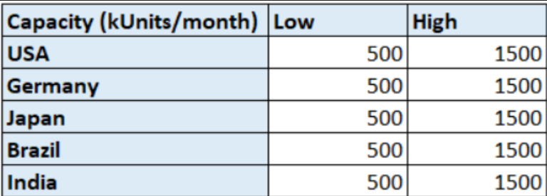
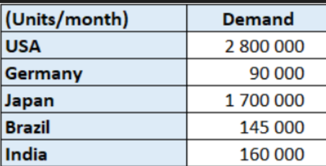

**SUPPLY CHAIN SOLVER USING MACHINE**

**LEARNING**

**INTRODUCTION**

This Project is a Python implementation of a supply chain network optimization model

using the PuLP library. The model is designed to help businesses make informed decisions

regarding their manufacturing and distribution processes. It considers various factors such as

fixed and variable costs, manufacturing capacities, shipping costs, and customer demand to

optimize the supply chain network.

**PROBLEM STATEMENT**
As a Supply Chain Management student, I am working on a project to redesign a global Supply Chain Network over a 5-year horizon. The network spans five key markets: Brazil, USA, India, Japan, and Germany. The project considers two types of manufacturing facilities: low-capacity and high-capacity sites. The objective is to optimize the network by incorporating recent increases in shipping costs and forecasted customer demand, while evaluating trade-offs across cost, capacity, and service levels.
Our considerations include

the following factors:

**Shipping Costs ($/container):** We need to analyze the costs associated with shipping containers

between different locations to determine the most cost-effective transportation routes.

**Customer Demand (Units/year):** Understanding the forecasted demand in each market is

crucial for aligning our production capacities with the needs of our customers.

**Manufacturing Facility Fixed Costs:**

By optimizing our supply chain network considering these factors, we aim to enhance

operational efficiency, minimize costs, and ensure timely delivery of products to meet customer

demands effectively.

1\. MANUFACTURING FIXED COST PER PLANT

This encompasses various expenses such as capital expenditure for equipment, utilities

(electricity, water), factory management, administrative staff, and space rental. These fixed costs

vary depending on the country and the type of manufacturing plant.

2\. MANUFACTURING VARIABLES COST

The variable cost includes the production line operators and cost of procuring raw materials for

manufacturing of the product.

3\. SEA FREIGHT SHIPPING COSTS ($/CONTAINER)

This table includes the cost of shipping the product from X to Y place in a container assuming 1

container contain 1000 containers.

4\. MANUFACTURING SITE CAPACITY

This table contains the capacity of each site to produce the units per month

5\. CUSTOMER’S DEMAND PER MARKET

This table contains the expected demand of the goods from each market around the globe per

month.

· **OBJECTIVE FUNCTION AND CONSTRAINTS:**

The objective function is defined to minimize total costs, considering fixed costs and variable

costs.

Constraints are added to ensure that production quantities meet demand and do not exceed

manufacturing capacities.

· **SOLVING THE MODEL AND ANALYSIS:**

The model is solved using the PuLP solver and we have taken 3 different scenarios which are

**1. INITIAL SCENARIO**

Brazil plant is producing for the local market and the USA to meet its demand

India plant produce for all countries except Brazil

Japan needs to produce locally because of the limited capacity of India

Total cost to produce the goods

**2. SCENARIO 2: OUTSOURCING TO LOW COSTS REGIONS**

What if we double the size of high-capacity plants in India?

Let us try to double the size of the India High Capacity plant, assuming that it will double the fixed

costs.

Brazil plant is still producing for the local market and the USA

India plants produce for all countries except Brazil

Japan does not produce locally anymore.

Final Costs

**3. SCENARIO 3: SURGING SHIPPING COSTS DUE TO CONTAINER SHORTAGE**

What if we have container costs multiplied by 5?

Brazil is producing for the local market only

The USA started to produce for the local market, and Japan

India closed its low-capacity factory

Japan starts to produce for its local market

Because of their limited production capacity, Japan and the USA still rely on the Indian plant.

Final Costs

· **HOW CAN THIS MODEL HELP BUSINESSES?**

1\. **Cost Reduction**: By optimizing the supply chain network, businesses can minimize

manufacturing and shipping costs, leading to overall cost reduction.

2\. **Capacity Planning**: The model assists in determining the optimal manufacturing capacity for

each location based on demand forecasts, thereby improving resource utilization and efficiency.

3\. **Demand Fulfillment**: By aligning production quantities with customer demand, businesses can

ensure timely delivery and enhance customer satisfaction.

4\. **Scenario Analysis:** The model allows businesses to simulate different scenarios (e.g., changes in

production capacity, fluctuations in shipping costs) to evaluate their impact on costs and make

informed decisions accordingly.

5\. **Risk Mitigation:** Businesses can use the model to identify potential risks such as supply chain

disruptions or capacity constraints and develop contingency plans to mitigate these risks.

### 6\. Competitive Advantage: Optimizing the supply chain network enables businesses to operate

more efficiently, leading to improved competitiveness and profitability in the market.

##  **HOW TO USE:**

Ensure you have Python installed on your system along with the necessary libraries (PuLP,

pandas).

Download the provided Python script and Excel files containing relevant data.

Run the script in a Python environment.

Analyze the results to make informed decisions about your supply chain network optimization.

## NOTE:

This model provides a foundational framework that can be customized and extended to suit

specific business requirements.

Continuous improvement and refinement of the model parameters based on real-world data and

feedback are recommended for ongoing optimization.

## CONTRIBUTOR:

Mrigendra Pratap Singh

For any inquiries or feedback, please contact 488mrigendrapratap@gmail.com

# Supply-chain-Cost-model

